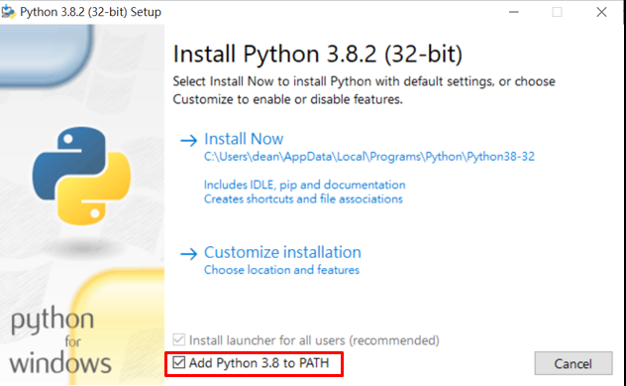

# Real-time-Brainwave-Car-Controller

## working environment

1. computer with windows OS(cygnus can only be run on windows OS)

2. [cygnus](https://drive.google.com/file/d/1sH7X4EFP8hUWEHtPcJr0E_8npi1PI3sR/view)


3. [Python3](https://www.python.org/downloads/)
  - when installing python, remember to select the enable path option
  
  - Please install python first as much as possible, because python have many installed tool and library like pip

4. [openvibe](http://openvibe.inria.fr/downloads/)
  
5. python Library installation

  ```
  pip install -r requirements.txt
  ```
   
6. file description
    - alpha_wave_bandpower.xml: code for openvibe
    - mind_controlled_car.py: collect data from openvibe and send commend to car
    - test_car.py: just for testing, you can use key board to test your car functionality
    
## 
